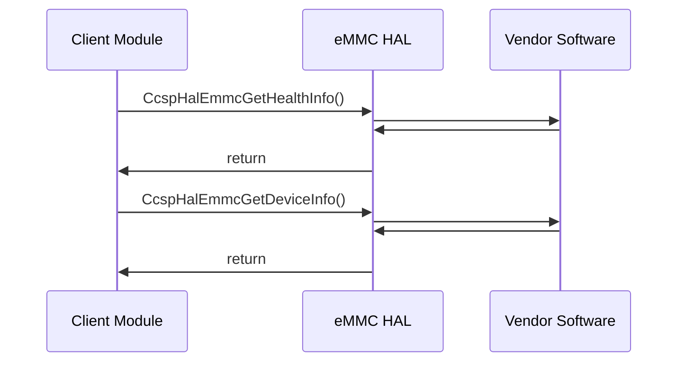

# eMMC HAL Documentation

## Acronyms

- `HAL` \- Hardware Abstraction Layer
- `RDK-B` \- Reference Design Kit for Broadband Devices
- `OEM` \- Original Equipment Manufacture

## Description
The diagram below describes a high-level software architecture of the eMMC HAL module stack.

eMMC HAL is an abstraction layer, implemented to interact with linux device drivers of eMMC for getting health and device informations. This HAL layer is intended to be a common HAL,should be usable by any Ccspcomponents or Processes.

## Component Runtime Execution Requirements

### Initialization and Startup

RDK eMMC HAL client module is expected to call the below corresponding API at runtime whenever Health and Device information are needed. The below API's are not called on bootup.

- `CcspHalEmmcGetHealthInfo`
- `CcspHalEmmcGetDeviceInfo`

This interface is expected to block if the hardware is not ready.

## Theory of operation

eMMC health and device information will be populated on device globally. We need to fetch the eMMC health and device informations from the populated data of block drivers.

## Threading Model

The interface is not required to be thread-safe.

Any module which is invoking the eMMC HAL api should ensure calls are made in a thread safe manner.

Vendors can create internal threads/events to meet their operation requirements. These should be responsible to synchronize between the calls, events and cleaned up on closure.

## Process Model

All API's are expected to be called from multiple process.

## Memory Model

eMMC HAL is responsible to allocate and deallocate memory for necessary API's to store information as specified in API Documentation.

Third-party vendors are required to allocate memory to meet their operational needs. In doing so, the vendor should also ensure they execute internal deallocation within their implementation.

TODO: State a footprint requirement. Example: This should not exceed XXXX KB.

## Power Management Requirements

The eMMC HAL is not involved in any of the power management operation.

## Asynchronous Notification Model

There are no asynchronous notifications.

## Blocking calls
Please see the blocking calls used in eMMC HAL which are static functions.
     1. read_sysbytes(const char* regpath, uint8_t *reg, char* hexstr, int size)
     2. read_extcsd(int fd, uint8_t *ext_csd)
     3. read_devicereport(int fd, uint8_t *report)
     4. read_status(int fd, uint32_t *response)
     5. read_csd(int fd, uint8_t *csd)
     6. read_cid(int fd, uint8_t *cid)

## Internal Error Handling

All the eMMC HAL API's should return error synchronously as a return argument. HAL is responsible to handle system errors(e.g. out of memory) internally.

## Persistence Model

There is no requirement for HAL to persist any setting information. The caller is responsible to persist any settings related to their implementation.

# Nonfunctional requirements

Following non functional requirement should be supported by the eMMC HAL component.

## Logging and debugging requirements

eMMC HAL component should log all the error and critical informative messages, preferably using syslog, printf which helps to debug/triage the issues and understand the functional flow of the system.

The logging should be consistent across all HAL components.

If the vendor is going to log then it has to be logged in `xxx_vendor_hal.log` file name which can be placed in `/rdklogs/logs/` or `/var/tmp/` directory.

Logging should be defined with log levels as per Linux standard logging.

## Memory and performance requirements

Make sure eMMC HAL is not contributing more to memory and CPU utilization while performing normal operations and Commensurate with the operation required.

## Quality Control

eMMC HAL implementation should pass checks using any third party tools like `Coverity`, `Black duck`, `Valgrind` etc. without any issue to ensure quality.

## Licensing

eMMC HAL implementation is expected to released under the Apache License 2.0

## Build Requirements

eMMC HAL source code should be capable of being built under Linux Yocto environment and should be delivered as a static library `libhal_emmc`.

## Variability Management

The role of adjusting the interface, guided by versioning, rests solely within architecture requirements. Thereafter, vendors are obliged to align their implementation with a designated version of the interface. As per Service Level Agreement (SLA) terms, they may transition to newer versions based on demand needs.

Each API interface will be versioned using [Semantic Versioning 2.0.0](https://semver.org/), the vendor code will comply with a specific version of the interface.

## eMMC HAL or Product Customization

None

## Interface API Documentation

All HAL function prototypes and datatype definitions are available in `ccsp_hal_emmc.h` file.
     1. Components/Process must include `ccsp_hal_emmc.h` to make use of platform hal capabilities.
     2. Components/Process should add linker dependency for `libhal_emmc`.

## Theory of operation and key concepts

Covered as per "Description" sections in the API documentation.

## Sequence Diagram

