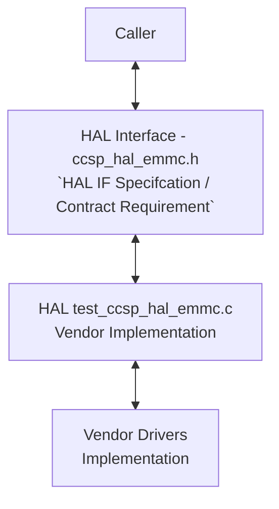
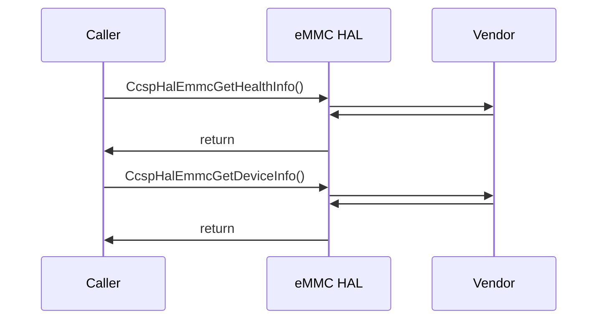

# eMMC HAL Documentation

## Acronyms

- `HAL` \- Hardware Abstraction Layer
- `RDK-B` \- Reference Design Kit for Broadband Devices
- `OEM` \- Original Equipment Manufacture

## Description
The diagram below describes a high-level software architecture of the eMMC HAL module stack.

eMMC HAL is an abstraction layer, implemented to interact with linux device drivers of eMMC for getting health and device informations. This HAL layer is intended to be a common HAL,should be usable by any Ccspcomponents or Processes.

## Component Runtime Execution Requirements

### Initialization and Startup

RDK eMMC HAL client module is expected to call the below corresponding API at runtime whenever Health and Device information are needed. The following API's are guaranteed not to be called during system bootup:

- `CcspHalEmmcGetHealthInfo`
- `CcspHalEmmcGetDeviceInfo`

This interface is expected to block if the hardware is not ready.

## Theory of operation

eMMC health and device information will be populated on device globally. We need to fetch the eMMC health and device informations from the populated data of block drivers.

## Threading Model

The interface is not required to be thread-safe.

Any module which is invoking the eMMC HAL api should ensure calls are made in a thread safe manner.

Vendors can create internal threads/events to meet their operation requirements. These should be responsible to synchronize between the calls, events and cleaned up on closure.

## Process Model

All API's are expected to be called from multiple process.

## Memory Model

### Caller Responsibilities:

   1. Allocate and deallocate memory for parameters passed to specific functions, as outlined in the API 
      documentation, to prevent memory leaks.

### Module Responsibilities:

   1. Manage and deallocate memory used for its internal operations.
   2. Release all internally allocated memory upon closure to prevent memory leaks.

TODO: State a footprint requirement. Example: This should not exceed XXXX KB.

## Power Management Requirements

The eMMC HAL is not involved in any of the power management operation.

## Asynchronous Notification Model

There are no asynchronous notifications.

## Blocking calls

The API's are expected to work synchronously and should complete within a time period commensurate with the complexity of the operation and in accordance with any relevant specification.

Any calls that can fail due to the lack of a response should have a timeout period in accordance with any API documentation.

## Internal Error Handling

All HAL APIs are designed to return all errors synchronously as part of their return arguments. The responsibility to manage system errors, such as memory shortages, lies internally with the caller.

## Persistence Model

There is no requirement for HAL to persist any setting information. The caller is responsible to persist any settings related to their implementation.

# Nonfunctional requirements

Following non functional requirement should be supported by the eMMC HAL component.

## Logging and debugging requirements

The component is should log all the error and critical informative messages which helps to debug/triage the issues and understand the functional flow of the system.

The logging should be consistence across all HAL components.

If the vendor is going to log then it has to be logged in `emmc_vendor_hal.log` file name.

Logging should be defined with log levels as per Linux standard logging.

## Memory and performance requirements

Make sure eMMC HAL is not contributing more to memory and CPU utilization while performing normal operations and Commensurate with the operation required.

## Quality Control

To maintain software quality, it is recommended that the eMMC HAL implementation is verified without any errors using third-party tools such as `Coverity`, `Black Duck`, `Valgrind`, etc.

## Licensing

eMMC HAL implementation is expected to released under the Apache License 2.0

## Build Requirements

eMMC HAL source code should be capable of being built under Linux Yocto environment and should be delivered as a static library `libhal_emmc.so`.

## Variability Management

The role of adjusting the interface, guided by versioning, rests solely within architecture requirements. Thereafter, vendors are obliged to align their implementation with a designated version of the interface. As per Service Level Agreement (SLA) terms, they may transition to newer versions based on demand needs.

Each API interface will be versioned using [Semantic Versioning 2.0.0](https://semver.org/), the vendor code will comply with a specific version of the interface.

## eMMC HAL or Product Customization

None

## Interface API Documentation

All HAL function prototypes and datatype definitions are available in `ccsp_hal_emmc.h` file.
     1. Components/Process must include `ccsp_hal_emmc.h` to make use of platform hal capabilities.
     2. Components/Process should add linker dependency for `libhal_emmc`.

## Theory of operation and key concepts

Covered as per "Description" sections in the API documentation.

## Sequence Diagram

