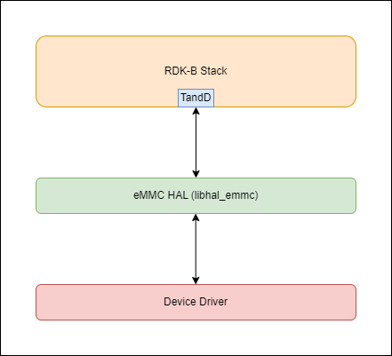
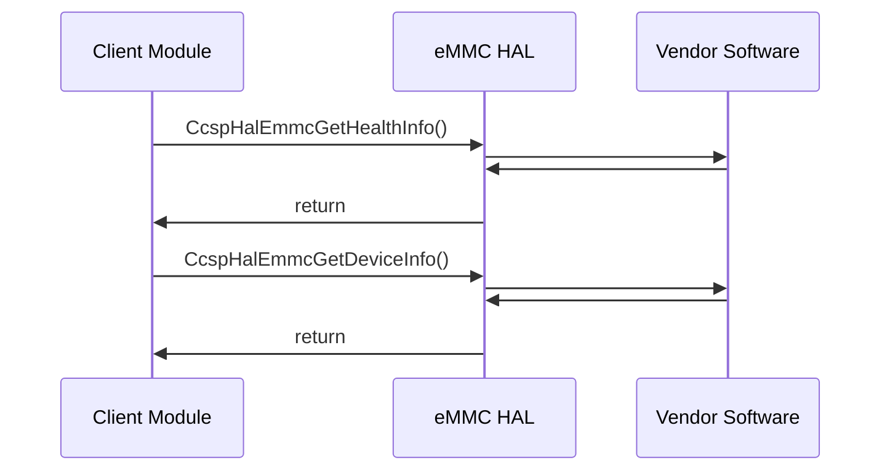

# eMMC HAL Documentation

# Version and Version History

1.0.0 Initial Revision covers existing eMMC HAL implementation.

## Acronyms

- `HAL` \- Hardware Abstraction Layer
- `RDK-B` \- Reference Design Kit for Broadband Devices
- `OEM` \- Original Equipment Manufacture

# Description
The diagram below describes a high-level software architecture of the eMMC HAL module stack.

eMMC HAL is an abstraction layer, implemented to interact with linux device drivers of eMMC for getting health and device informations. This HAL layer is intended to be a common HAL,should be usable by any Ccspcomponents or Processes.

# Component Runtime Execution Requirements

## Initialization and Startup

RDK eMMC HAL client module is expected to call the below corresponding API at runtime whenever Health and Device information are needed. The below API's are not called on bootup.

- CcspHalEmmcGetHealthInfo
- CcspHalEmmcGetDeviceInfo

It is upto the 3rd party vendors to handle it appropriately to meet operational requirements. Failure to meet these requirements will likely result in undefined and unexpected behaviour.

## Theory of operation

eMMC health and device information will be populated on device globally. We need to fetch the eMMC health and device informations from the populated data of block drivers.

## Threading Model

eMMC HAL is not thread safe, any module which is invoking the eMMC HAL api should ensure calls are made in a thread safe manner.

Different 3rd party vendors allowed to create internal threads to meet the operational requirements. In this case 3rd party implementations
should be responsible to synchronize between the calls, events and cleanup the thread.

## Memory Model

eMMC HAL client module is responsible to allocate and deallocate memory for necessary API's to store information as specified in API Documentation.
Different 3rd party vendors allowed to allocate memory for internal operational requirements. In this case 3rd party implementations should be responsible to deallocate internally.

## Power Management Requirements

The eMMC HAL is not involved in any of the power management operation. Any power management state transitions MUST not affect the operation of the eMMC HAL.

## Asynchronous Notification Model
None

## Blocking calls
Please see the blocking calls used in eMMC HAL which are static functions.
     1. read_sysbytes(const char* regpath, uint8_t *reg, char* hexstr, int size)
     2. read_extcsd(int fd, uint8_t *ext_csd)
     3. read_devicereport(int fd, uint8_t *report)
     4. read_status(int fd, uint32_t *response)
     5. read_csd(int fd, uint8_t *csd)
     6. read_cid(int fd, uint8_t *cid)

## Internal Error Handling

All the eMMC HAL API's should return error synchronously as a return argument. HAL is responsible to handle system errors(e.g. out of memory) internally.

## Persistence Model

There is no requirement for HAL to persist any setting information. Application/Client is responsible to persist any settings related to their implementation.

# Nonfunctional requirements

Following non functional requirement should be supported by the eMMC HAL component.

## Logging and debugging requirements

eMMC HAL component should log all the error and critical informative messages which helps to debug/triage the issues and understand the functional flow of the system.

## Memory and performance requirements

Make sure eMMC HAL is not contributing more to memory and CPU utilization while performing normal operations and Commensurate with the operation required.

## Quality Control

eMMC HAL implementation should pass Coverity, Black duck scan, valgrind checks without any issue. There should not be any memory leaks/corruption introduced by HAL and underneath 3rd party software implementation.

## Licensing

eMMC HAL implementation is expected to released under the Apache License.

## Build Requirements

eMMC HAL source code should be build under Linux Yocto environment and should be delivered as a static library libhal_emmc.

## Variability Management

Any new API introduced should be implemented by all the 3rd party module and RDK generic code should be compatible with specific version of eMMC HAL software

## eMMC HAL or Product Customization

None

## Interface API Documentation

All HAL function prototypes and datatype definitions are available in ccsp_hal_emmc.h file.
     1. Components/Process must include ccsp_hal_emmc.h to make use of platform hal capabilities.
     2. Components/Process should add linker dependency for libhal_emmc.

## Theory of operation and key concepts

Covered as per "Description" sections in the API documentation.

### UML Diagrams

#### Sequence Diagram

